# Neglected Tropical Diseases Disease-specific module: Schistosomiasis System Design Guide { #ntd-sch-ds-design }

## Background and Purpose

The **Schistosomiasis (SCH) disease-specific module** builds upon the design principles and implementation guidance outlined in the overarching **Neglected Tropical Diseases (NTD) DHIS2 module**. While the overarching module provides a unified framework for integrating NTD data into national health management information systems (HMIS), this document focuses specifically on the technical design considerations and metadata configuration required for the **routine collection, reporting, and use of Schistosomiasis-related data**.

As with the broader NTD package, the SCH-specific module is aligned with **WHO guidelines and global best practices** for disease surveillance, monitoring, and control. It supports country-level efforts to localize and adapt the metadata to fit their specific national workflows and reporting requirements. This ensures consistency with local epidemiological profiles and aligns with **national strategies for NTD control and elimination**.

SCH remains a major public health challenge in many endemic countries, and its control is a core focus within the **[WHO 2021–2030 road map for NTDs](https://www.who.int/publications/i/item/9789240062863)**, which sets targets to reduce disease burden and ultimately eliminate the need for interventions. By standardizing SCH data collection and enabling better visualization and analysis, this module supports countries in tracking progress toward those goals—such as increasing coverage of preventive chemotherapy (PC), monitoring morbidity trends, and identifying persistent transmission hotspots.

This system design guide provides detailed documentation of the **SCH data elements, indicators, datasets, program stages, and relationships** used in the module, and includes recommendations for how implementers can **adapt, extend, or integrate** the SCH module into existing HMIS platforms.

## System Design Overview

### Module Structure

The SCH disease-specific module is built through three datasets

| Dataset                       | Periodicity | Description                                                                                                                                                  |
|-------------------------------|-------------|--------------------------------------------------------------------------------------------------------------------------------------------------------------|
| NTD-SCH-DS - Schistosomiasis IVM | Monthly     | It contains the key information on water treatment and the monitoring of vectors (by snail spp.).|
| NTD-SCH-DS - Schistosomiasis surveillance         | Monthly   | It contains the key variables for the monitoring of the burden of the disease, treatment, and an overview of the disease location.    |
| NTD-SCH-DS - Schistosomiasis screening        | Monthly     | It contains the information extrapolated during surveys and outreach screening activities on burden, examinations, and treatment.       |

### Intended users

- **Health facility** users: capture and report key data on malaria activities
- **Program managers**: managers at national and sub-national level may be responsible for supporting data entry and analysis.
- **National and local health authorities**: to monitor and analyze the surveillance of data through dashboards and analytics tools, to conduct risk assessments and plan response measures; to generate reports for regional and global reporting

### Dataset: NTD-SCH-DS - Schistosomiasis IVM

The dataset is intentionally streamlined and includes key information needed to monitor **water sources targeted for treatment** and the presence of **vector species**. It’s important to note that the vector species included in the default configuration are aligned with the *Schistosoma* species represented in the Surveillance dataset. If countries choose to add or remove specific parasite species to better reflect their local epidemiology, the corresponding vector species in this dataset will also need to be adjusted accordingly.

The dataset is currently assigned at district level to follow the same logic as the IVM and Entomology products currently available, but implementers can assign at the most relevant administrative level locally.

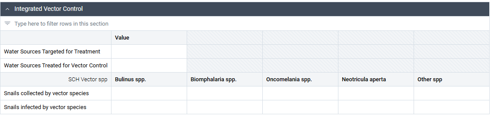

### Dataset: NTD-SCH-DS - Schistosomiasis surveillance

The dataset is designed for the **reporting of diseases at the point of care (health facility level)**.

#### Burden of Disease Section

The section reports the key surveillance data points to be monitored for reporting. It has a **flat structure** and are disaggregated by **sex (male and female) and by Global NTD Annual Reporting Form (GNARF) age groups (less than 1y, 1 -4y, 5-14y, 15-24y, 25-49y, 50-64y, 65+ years)**.

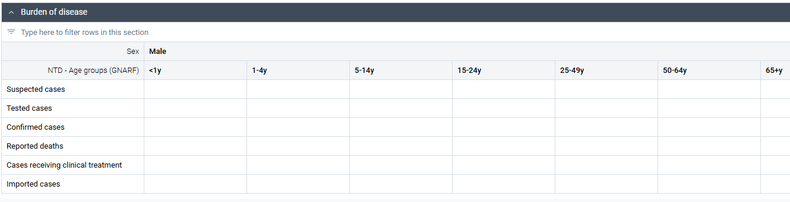

#### Cases by Diagnostic Method Section

Although **clinical diagnosis** is often the most commonly used method for confirming schistosomiasis cases, this section also allows for the reporting of **laboratory confirmation by method**. Where alternative diagnostic methods are available at the local level, the **CoC** list (currently including: Dispstick, Kato Katz, CCA, CAA, Biopsy, PCR, Serology, Other) can be adapted accordingly to reflect those options.

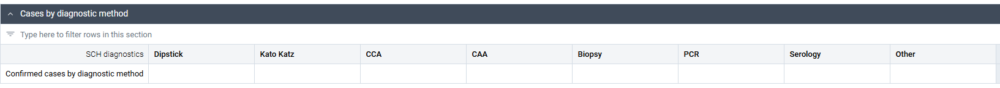

#### Cases by Species Section

This section captures the number of confirmed cases by **Schistosoma species** (currently including: *S. haematobium, S. mansoni, S. japonicum, S. intercalatum, S. mekongi, S. guineensis, Other spp*), ensuring alignment with the vector species listed in the **Integrated Vector Management (IVM)** dataset. Implementers should ensure that any modifications to the list of parasite species are reflected in the corresponding vector species list, to maintain consistency across datasets and support accurate analysis.

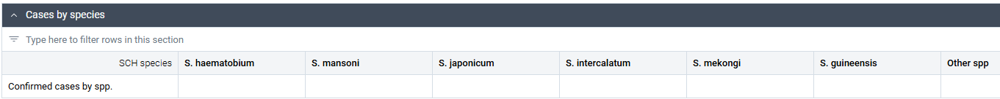

#### Cases Receiving Treatment by Treatment Type Section

This section records the number of cases treated, disaggregated by **type of treatment**: **Praziquantel (PZQ), surgery, PZQ + surgery, and other**. It is important to note that the **total number of cases reported in this section should match** the number of cases receiving clinical treatment as recorded in the initial section of this dataset. This ensures internal consistency and accurate tracking of treatment coverage.

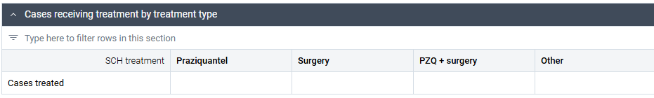

#### Animals Treated by Species Section

The section reports the number of animals treated for schistosomiasis by animal - Cow, Sheep, Pig, Water buffalo, Dog, Other.

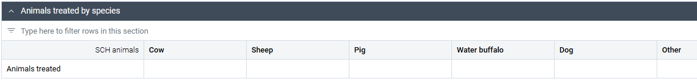

#### Hepatic and Urinary Tract Lesions Section

This section is designed to capture the types of **hepatic** and **urinary tract (UT)** morbidities observed during clinical examination. For hepatic complications, it includes conditions such as **periportal fibrosis (PPF), hepatosplenomegaly, portal hypertension, ascites, hematemesis, and other**. For urinary tract complications, it covers findings such as **urinary bladder fibrosis and calcification, hydronephrosis and hydroureter, bladder ulcers and granulomas, bladder cancer**, and **other lesions**.

In addition to recording specific types of morbidity, the section also includes the **aggregate number of lesions** reported by **anatomical location: bladder, kidneys, urethra, lower genital tract, and upper genital tract**. It is important that the number of lesions recorded across the different tally fields (hepatic, urinary tract, and location) are consistent and internally aligned.

While this section is part of the current dataset, it may also be **cloned and adapted** for use in the third dataset—specifically the one dedicated to reporting activities conducted during **surveys and outreach activities**. Implementers are encouraged to consult with relevant programme leads to determine whether this morbidity reporting section provides **additional value** beyond what is already included in the **NTD-SCH-DS: Schistosomiasis Screening Dataset**.

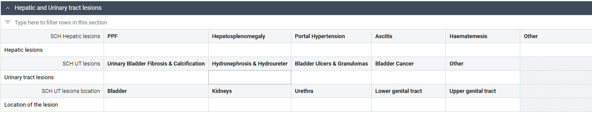

### Dataset: NTD-SCH-DS: Schistosomiasis Screening

The dataset is made up of a single section collecting data on an individual screened, information on examinations and ultrasound, heavy intensity infection and on PC/MDA requirements. All the data points are disaggregated by **sex (male and female) and by Global NTD Annual Reporting Form (GNARF) age groups (less than 1y, 1 -4y, 5-14y, 15-24y, 25-49y, 50-64y, 65+ years)**.

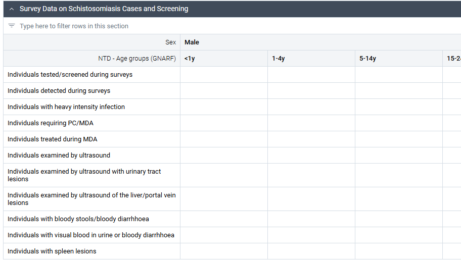

## Dashboard

The **SCH toolkit** includes a **predefined dashboard** (NTD - Schistosomiasis) organized into three distinct sections, each corresponding to one of the three core datasets. This structure supports users in navigating and interpreting data collected through the surveillance, the IVM, and **survey/outreach** activities, providing a clear and cohesive view of schistosomiasis surveillance and program performance.

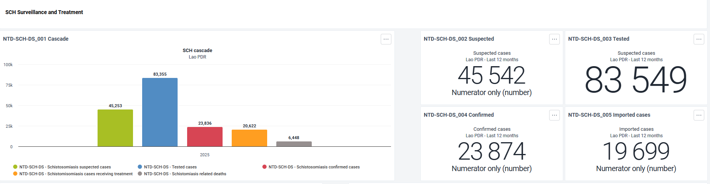

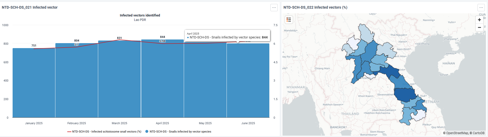

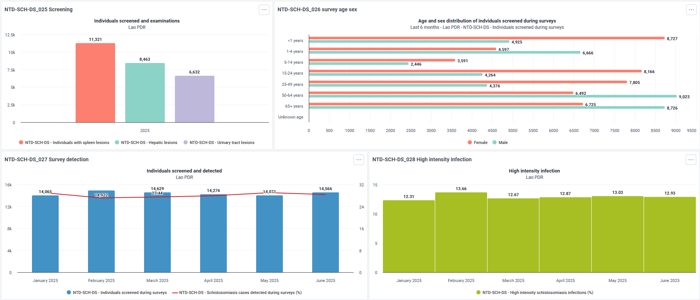

## Special Considerations

### Triangulating Data from Health Facilities and Community Sources

Triangulating **Neglected Tropical Disease (NTD)** surveillance data from both **health facilities and community-level sources** is essential for building a more complete and actionable understanding of disease patterns. This integrated approach enhances the **accuracy, completeness, and timeliness** of data, allowing health programs to better detect outbreaks, identify transmission hotspots, and deploy more targeted interventions.

Health facility data offers detailed clinical and treatment insights, while community-based data can capture **cases, symptoms, and environmental risk factors** that may not reach formal healthcare settings—especially in areas with limited access to care. Together, these sources help bridge surveillance gaps, improve resource allocation, and support **evidence-based decision-making** for more effective NTD control strategies.

In the case of **Schistosomiasis (SCH)**, WHO guidance highlights the importance of community-level monitoring and surveillance, particularly for identifying risk behaviors, environmental exposure, and subclinical morbidity. Much of the required metadata for community-based NTD surveillance is already mapped in the **[NTD overarching module](https://docs.dhis2.org/en/implement/health/neglected-tropical-diseases/ntd-overarching-module/design.html#ntd-overarching-indicators) - Special considerations chapter -** and aligned with the **[DHIS2 Community Health Information Systems (CHIS) toolkit](https://docs.dhis2.org/en/implement/health/chis-community-health-information-system/overview.html)**.

The list below summarizes the key community-level data requirements from WHO: 

- Number of schistosomiasis cases detected during the site survey
- Number of people treated using schistosomiasis test & treat strategy
- Number of individuals reporting visible hematuria or with positive dipstick for micro-hematuria
- Number of individuals screened
- Number of people receiving a dose of PC for deworming according to national policy
- Number of people receiving a dose of PC (PZQ) against NTDs according to national policy
- Number of people targeted for PC (PZQ) against NTDs according to national policy
- Number of households in the targeted communities that received social mobilization/ awareness campaigns on schistosomiasis

If additional SCH-specific community indicators are needed and not already included in the existing metadata, implementers have two options:

- Integrate the missing variables into their current CHIS configuration, if one exists, to ensure streamlined data capture within existing workflows
- Create a dedicated dataset for SCH-specific community surveillance, which can operate alongside the broader CHIS or NTD modules.

This flexible approach ensures that all relevant community-level information is captured, regardless of the country's existing system maturity, and supports a more robust, responsive surveillance system for SCH control and elimination.

### NTD Staff Metadata

Integrating information on health staff and their NTD-specific training into the **Health Facility Profile (HFP)** program—within the broader **Healthcare System Accessibility** domain—greatly enhances the quality and strategic value of health system data. The **[HFP toolkit](https://docs.dhis2.org/en/implement/health/health-facility-profile/design.html#introduction)** in DHIS2 is designed to support structured and routine data collection on facility attributes, including infrastructure, service availability, and workforce readiness. When integrated into the national **HMIS**, this toolkit provides a comprehensive view of service delivery capacity and supports evidence-based planning and response.

To avoid duplication and ensure consistency, it is important to note that a **[dedicated dataset for NTD staff and training information already exists in the NTD overarching module](https://docs.dhis2.org/en/implement/health/neglected-tropical-diseases/ntd-overarching-module/design.html#data-set-ntd-human-resources)**. This dataset includes key variables relevant to workforce capacity for NTD program implementation. Depending on a country’s configuration and workflow preferences, implementers should choose one of the following integration paths:

- **If using the HFP program** as part of national infrastructure mapping, relevant NTD workforce data—such as the number of trained staff, training types, and date of last training—should be integrated directly into the HFA data collection forms using the toolkit's **dynamic digital questionnaire format**.
- **If using the NTD Staff dataset from the overarching module**, implementers should ensure that this dataset includes all critical staff-related attributes and is updated regularly. Where appropriate, this dataset can be **linked or cross-referenced with HFP data** to enable unified reporting and reduce fragmentation.

In both cases, the goal is to support **modular and flexible data management**, while ensuring that accurate, up-to-date information on human resources for NTD control is readily available. This enriched and integrated dataset is vital for **resource planning, training program evaluation, and emergency response preparedness**, particularly in endemic and high-risk areas.

Depending on the preferred route, implementers should add to the chosen module this data point “Number of health workers receiving integrated in-serving training on FGS (female genital schisto) at least once a year”.

### Triangulating SCH Surveillance with Environmental and Vector Monitoring

Integrating **schistosomiasis surveillance** with environmental and vector monitoring is a key strategy for understanding transmission dynamics and strengthening disease control efforts. Given SCH's complex lifecycle — requiring both** human and freshwater snail hosts** — a siloed approach to surveillance limits the ability to detect transmission risks early and respond effectively.

Triangulating data from **human case surveillance, environmental assessments (e.g., water source mapping), and intermediate host monitoring** allows public health authorities to identify potential hotspots, assess the risk of ongoing transmission, and tailor interventions such as snail control, water treatment, or behavior change communication.

The **DHIS2 platform** supports this integrated approach by enabling the alignment of human health data with **animal health and vector datasets**, including those from the **[Entomology and Integrated Vector Management (IVM)](https://docs.dhis2.org/en/implement/health/entomology-and-vector-control/general-design.html)** toolkit and the [Animal Health](https://docs.dhis2.org/en/implement/health/animal-health/event-based-surveillance/overview.html) toolkit. By linking SCH case data with vector species presence, animal health, and water body status, countries can implement a more proactive, **One Health-aligned strategy**. This cross-sectoral collaboration improves the targeting of interventions and promotes a more holistic response to SCH control and eventual elimination.
